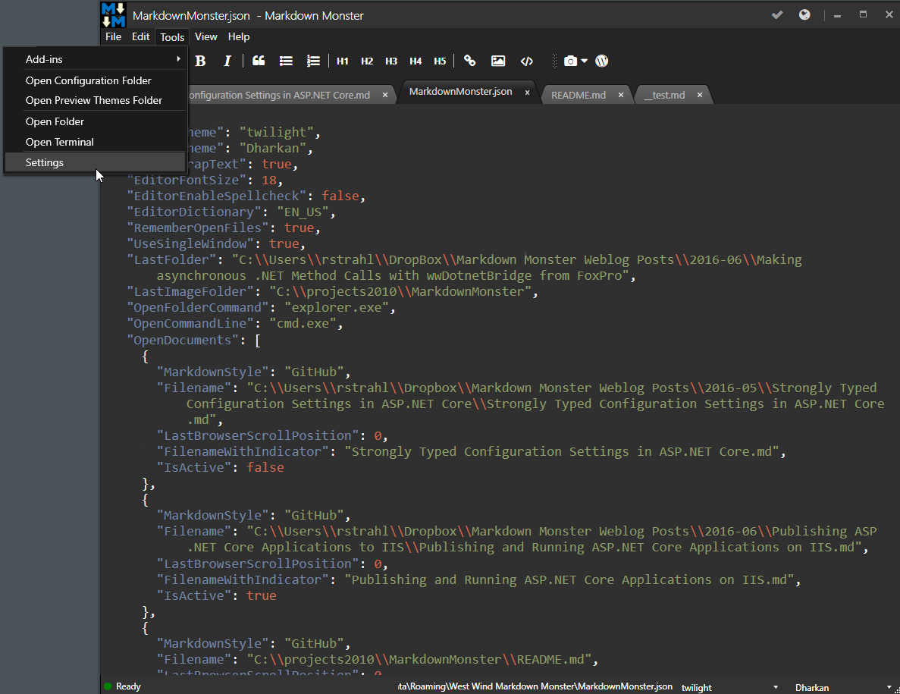

You can configure Markdown Monster via a `MarkdownMonster.json` file. The configuration is managed as a JSON document that you can simply edit.

You can access this file directly from the Markdown Monster UI via **Tools -> Settings**:



There are a number of settings in this file that control how Markdown Monster behaves. Any changes you make in this document are immediately applied when you save the document (ctrl-s).

The default location of the configuration file is:

`%appdata%\West Wind Markdown Monster\MarkdownMonster.json`

> #### @icon-info-circle Changing Configuration Folder to DropBox or OneDrive
> You can also change configuration folder using the **CommonFolder** setting in the Markdown Monster Settings at **Tools -> Settings**. For example, you can easily set the folder to a shared location like Dropbox:
`CommonFolder="C:\\Users\\rick\\Dropbox\\Markdown Monster Common"`

### Setting Values
Following are some of the configuration options:

#### ApplicationTheme
The application theme determines the application major theme for the window and controls. 

* Dark
* Light

>  @icon-exclamation-circle Any changes made to the ApplicationTheme requires a restart of Markdown Monster to properly render all the theme changes.

#### EditorTheme 
The theme used by the Markdown editor. A variety of themes can be used including `twilight`,`visualstudio`,`github`,`monokai`, `mono_industrial`.  You can also change the editor theme via the drop down on the bottom right of the form. These themes are stored in the `Editor\scripts` folder with a `theme-`.

#### PreviewTheme  
The theme used by the HTML Preview browser. Several themes are available including `Dharkan`, `Blackout`, `GitHub`, `Hipster`. You can also change the preview theme via the drop down on the bottom right of the form. These themes are fairly simple plain HTML themes and can be easily created or modified to match whatever style you want to see in the previewer. Look in the `PreviewThemes` folder.

#### PreviewSyncMode
Determines if and how the Preview window is synced with the editor. The following values can be used:

* EditorToPreview
* PreviewToEditor
* EditorAndPreview
* None

#### AutoSaveDocuments
If `true` automatically saves documents to disk as you type. Document and file are always nearly in sync (except for the 1 second or so no-typing delay before text is updated). This setting overrides the **AutoSaveBackups** option if set. No backups are created if this option is `true`.

#### AutoSaveBackups
Set this option to `true` to backup your working files while you are working, but before they are saved. In case of a crash the backup document is opened in addition to the actual document so you can compare or choose the recovered content. No backups are created if **AutoSaveDocuments** is `true`.

#### AlwaysUsePreviewRefresh
Determines whether the Preview is always refreshed fully or (default) just replacing content. The default behavior of content replacement is quicker with less flicker, but cannot update embedded scripts or other dynamic content. If you are embedding dynamic content that includes script tags or expanding widgets set this flag to `true`.

#### DistractionFreeModeHideOptions
This flag lets you configure what's hidden in distraction free mode. Distraction free mode is accessed via the @icon-arrows-alt icon on the Window bar or Alt-Shift-Enter.

This option takes a comma delimited list of the following values:

```txt
"toolbar,statusbar,menu,preview,tabs,maximized"
```

Each of the items included is **hidden**. Any of these value mentioned hide the corresponding UI item. 

The exception is `maximized` which if specified, maximizes the window. Otherwise the Window stays its original size.

#### EditorHighlightActiveLine
Determines whether the active line in the editor is highlighted. Highlight color is relatively subtle in most themes so this is recommended.

#### EditorWrapText
Determines whether text in the editor wraps - almost certainly you'll want to leave this flag at `true`.

#### EditorFont
The name of the font to use in the editor. The font used **has to be a monospaced font** like **Consolas** (default), **Courier New**, **Lucidia Console** or installed monospace fonts like **Fira Code**, **Haskell** etc. Using proportional fonts likw Segoe UI, Arial, etc. doesn't work and will cause cursor offset issues. You can also use `monospace` which will default to the default monospace font (usually Courier New) for Internet Explorer.

#### EditorFontSize
Font size in pixels and the default size is 18px.

#### EditorEnableSpellCheck
Toggles the spellchecking feature in the editor. This flag is also triggered by the checkmark icon on the Window control box.

#### EditorAllowScriptTags
Determines whether script tags are rendered into the HTML as is (as raw HTML script) or are encoded and stripped for security. Set to `true` if you want to embed script tags explicitly (like Gist Snippets or other Widgets for example).

#### EditorDictionary
The dictionary used. By default the US English one is used by `de-DE`, `fr-FR` and `es-ES` are also shipped. You can add any other OpenOffice compatible dictionaries using `aff` and `dic` files and reference them here by copying them into the `Editors` folder. [More info](VFPS://Topic/_4TE0RA79S).

#### EditorKeyboardHandler
Allows you to set keyboard themes. Supported values are:
    * default
    * vim
    * emacs

#### RememberLastDocuments
Number that determines how many of the last open documents to re-open when Markdown Monster restarts. The default is 3.

#### OpenInPresentationMode
If set to `true` starts the editor in presentation mode that displays the rendered HTML in full screen mode.

#### UseSingleWindow
Flag that determines whether Markdown Monster only opens a single window for all documents. New documents opened are then pushed into a new tab, rather than a new instance opening. If false each document opened externally via file association or launch from explorer will open a new instance.

#### ImageEditor
Allows you to specify an external Image Editor to use. If not specified uses Windows' built-in `Paint.exe`.

#### Image Viewer
Allows you to specify an external Image Viewer to display images. If not specified uses the default Windows system viewer which if not reconfigured is PhotoViewer.

#### WebBrowserPreviewExecutable
Lets you specify a browser to use to externally view rendered HTML content. By default uses Chrome if installed. You can override with a path to a browser executable or leave blank for the system default.

#### OpenFolderCommandfile:///C:/Users/rstrahl/Documents/Html%20Help%20Builder%20Projects/markdownmonster/__preview_ext.htm#TerminalCommandandTerminalCommandArguments
Allows you to specify the executable used to open an external folder view from the Folder Browser or Document Tab context menu. Defaults to `explorer.exe`.

#### TerminalCommand and TerminalCommandArguments
These two commands are used to open a command prompt off the tab's context, Tools menu or the File and Folder Browser. The `{0}` is used by MM to inject the path. 

The **TerminalCommand** is the command interpreter used which defaults to **Powershell**. The arguments are the stock arguments to open the shell in a specific folder.

**Powershell**
```json
  "TerminalCommand": "powershell.exe",
  "TerminalCommandArgs": "-noexit -command \"cd '{0}'\"",
```
**Command**
```json
  "TerminalCommand": "cmd.exe",
  "TerminalCommandArgs": "/k cd /D \"{0}\"",
```

### Markdown Options
There are a number of options that allow you to configure how the Markdown Parser interprets the Markdown text.

<div style='margin: 40px;'>

#### AutoLinks
Determines whether URLs are automatically turned into links. `true`

#### Abbreviations
Determines whether common abbreviations are expanded. `false`

#### StripYamlFrontMatter
Strips Yaml FrontMatter from any Markdown content. `true`

#### EmojiAndSmiley
Interprets common emoji and smiley characters like `:smile:` or `:-)` and turns it into Emoji. `true`

#### ListExtras
Provides features like Github Check lists and nested lists: `true`

#### Figures 
Allows for figure referencing in a location other than the current location. true

#### GithubTaskLists
Allows for Github checkable task lists by using `[ ]` and `[x]`.

#### SmartyPants
Converts common typographic characters to proper typographic publishing settings. Quotes to curly quotes dashes to em dashes etc. Use for print publishing of literature - leave off for technical content. `false`

#### Diagrams
Support for Mermaid markup. Note the MM preview doesn't support Mermaid, but the renderer produces it and you can preview in the external browser.

#### RenderLinksAsExternal
Renders all links with a target="_blank" to force links to be externally opened in a new tab/window. Useful in some documentation scenarios where you don't want to lose your place in the document. `false`

#### AllowRenderScriptTags
By default script tags are stripped from Markdown content. Set to true if you need to explicitly run scripts as part of your markdown for things like embedded Gists for example. `false`

#### MarkdownParserName
This is the name of the Markdown Parser used. MM ships with `MarkDig` which is the default parser, but addins can add additional parsers which are selectable from the dropdown on the status bar. `Markdown`

#### MarkdigExtensions
Allows you to explicitly specify MarkDig extensions to load. MM loads a default set, but you can modify this list which allows you to add custom extensions.
`emphasisextras,pipetables,gridtables,footers,footnotes,citations,attributes`

</div>

### FolderBrowser

<div style="margin: 40px;">

#### FolderPath
Last used Folder Path that is remembered when the FolderBrowser is opened again.

#### IgnoredFolders
Folders that the folder browser ignores and doesn't show. `.git,node_modules`

#### IgnoredFileExtensions
File extensions that the folder browser ignores. Set this to temporary files that might get created and deleted frequently. Defaults to exclude MM backup edit files. `.saved.bak`

#### ShowIcons
Determines whether the folder browser shows icons. Not using icons improve folder browser rendering and reduces memory usage slightly. Also removes icons from tabs when `false`. `true`

</div>

### ApplicationUpdates
This section of the configuration determines how frequently Markdown Monster checks for new versions.

The remainder of the settings are operational settings that store current state of the application like open documents, window position, last folder used and so on. You see it here in the edit view and you can certainly modify things here, but typically you'll leave those values alone.

### EditorExtensionMapping
This section holds collection string values that map a file extension (key) to an ACE Editor syntax language. You can create multiple extension mappings to the same syntax language, so you can map `xml` and `xaml` and `config` files all to the `xml` syntax for example.

### WindowPosition
These section hold your last window positions and widths for various panels. While you can edit these values, these are reset each time you shut down Markdown Monster.