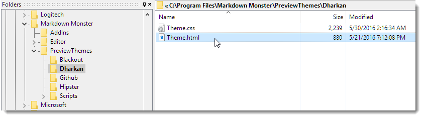
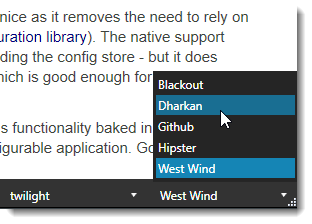

Preview Themes control how the Preview Window renders your Markdown text into HTML. A theme is nothing more than a folder with a `Theme.html` file that embeds the rendered HTML.



You can easily create custom Preview Themes or change existing themes by simply changing the HTML and CSS files that are provided.

> #### @icon-warning Modify Existing Themes by creating a Copy with a new Name
>We recommend you **don't directly modify the built-in themes** in place, because these Preview Themes are **overwritten during updates**. 
>
>If you want to override a Preview Theme, it's best to make a copy of the folder with a new name and then modify the copy. The folder name is what shows up as the new Preview Theme name.


#### How Themes work
Themes are found based on the folder name in the `PreviewThemes` folder. Any folder in this folder will be available in the Preview theme selector:



Any folder you add will automatically show up in this list. It'll expect a `Theme.html` to exist in that file and the file has to follow a common template:

```html
<!DOCTYPE html>
<!-- saved from url=(0016)http://localhost -->
<html lang="en" xmlns="http://www.w3.org/1999/xhtml">
<head>
    <meta charset="utf-8" />    
    <meta http-equiv="X-UA-Compatible" content="IE=edge" />
    <link href="{$themePath}..\scripts\bootstrap\css\bootstrap.min.css" rel="stylesheet" />
    <link href="{$themePath}..\scripts\fontawesome\css\font-awesome.min.css" rel="stylesheet"/>
    <link href="https://fonts.googleapis.com/css?family=Open+Sans" rel="stylesheet" />
    <link href="{$themePath}Theme.css" rel="stylesheet" />
</head>
<body>
    <div id="MainContent" >
        {$markdownHtml}
    </div>
    <script src="{$themePath}..\scripts\jquery.min.js"></script>
    <link href="{$themePath}..\scripts\highlightjs\styles\twilight.css" rel="stylesheet" />
    <script src="{$themePath}..\scripts\highlightjs\highlight.pack.js"></script>
    <script src="{$themePath}..\scripts\preview.js"></script>
</body>
</html>
```

If you create a new theme, maintain the overall structure of this document. Typically if you customize you either customize the `theme.css` file and its styles, or you load a CSS stylesheet from an Web location to render in sync with some server location like your Web log for example.

There are a two template variables:

* **{$markdownHtml}**
This is where your rendered HTML is injected.

* **{$themePath}**  
This is the physical disk path to the preview folder (with a trailing slash). Markdown Monster renders HTML from this template into the folder where the Markdown file lives so that it can find any relative images and links properly. In order to find the related theme resources they have to be known and `{$themePath}` provides this known location.


#### Creating a new Local Theme
Local themes simply use local resources for the CSS styling as shown in the last example. The CSS is linked directly from a local resource. This is the easiest way to deal with resources.

To create a new theme:

* Copy an existing folder from `PreviewThemes`
* Rename it to the name you want to see for the Theme
* Modify the `theme.html` or `theme.css` files to customize


#### Web Theme
You can also reference Web resoures directly. For example, you might want to use the theme from your Weblog so your preview looks exactly like the blog you're going to post from your markdown.

You can simply link an external stylesheet to make that work. However, you probably will still need a little bit of extra CSS to format the base document.

For example, I have a custom West Wind theme that has the following `Theme.html` page:

```html
<!DOCTYPE html>
<!-- saved from url=(0016)http://localhost -->
<html lang="en" xmlns="http://www.w3.org/1999/xhtml">
<head>
    <meta charset="utf-8" />    
    <meta http-equiv="X-UA-Compatible" content="IE=edge" />
    <link href="{$themePath}..\scripts\fontawesome\css\font-awesome.min.css" rel="stylesheet"/>

    <!-- link style sheet from the site -->
    <link href="https://weblog.west-wind.com/App_Themes/Standard/Standard.css" type="text/css" rel="stylesheet"/>
    
    <!-- small amount of fixups -->
    <link href="{$themePath}Theme.css" style="text/css" rel="stylesheet" />
</head>
<body>
    <div id="MainContent" >
        {$markdownHtml}
    </div>
    <script src="{$themePath}..\scripts\jquery.min.js"></script>
    <link href="{$themePath}..\scripts\highlightjs\styles\twilight.css" rel="stylesheet" />
    <script src="{$themePath}..\scripts\highlightjs\highlight.pack.js"></script>
    <script src="{$themePath}..\scripts\preview.js"></script>
</body>
</html>
```
Notice the link to the external style sheet on [weblog.west-wind.com](http://weblog.west-wind.com). I still use a local theme.css to style the toolbar and the main HTML page padding:

```css
html, body {
    padding: 5px 20px 5px 10px !important;
    margin: 0;
    scrollbar-track-color: Whitesmoke;
    scrollbar-arrow-color: silver;   
    scrollbar-base-color: #ddd;
    scrollbar-face-color: #ddd;
    -ms-overflow-style: -ms-autohiding-scrollbar !important;
} 

@media(min-width: 970px){
    html,body{
        font-size: 1.1em;
    }
}
```

Very minor obviously but this ensures I get the right document margins and the nicer looking scrollbars in the preview.

Another option is to simply download the remote CSS and use it locally rather than load it from the Web site and then reference the local copy:

```html
<link href="{$themePath)Standard.css" type="text/css" rel="stylesheet"/>
<link href="{$themePath}Theme.css" style="text/css" rel="stylesheet" />
```

### Change the Code Snippet Theme in your Preview Theme
The previewer supports code snippets using the popular <a href="https://highlightjs.org/" target="top">highlight.js</a> and the corresponding syntax language formats. This is compatible with GitHub for common languages.

If you want to alter the code theme you can change the following style link to reference one of the other code themes available in the referenced folder:

```html
<link href="{$themePath}..\scripts\highlightjs\styles\twilight.css" rel="stylesheet" />
```

The default code theme used is `twilight`. Other code themes include `github`,`vs` (light), `vs2015` (dark), `monokai` and many more. Check the highlightjs\styles folder for more code themes.

Note the various preview themes use several different code snippet themes and you can do the same for your own themes to match the way codeblocks render to better match with your theme.

### Go to Town
The concepts for customization are really easy and it should be a snap to create new themes if you want to match your styling to your site or application. 


