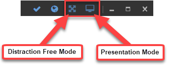
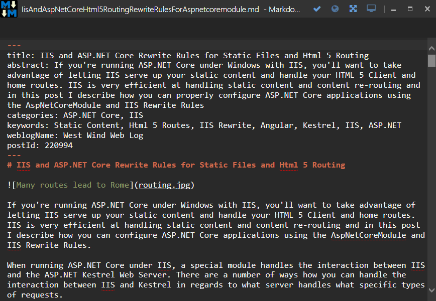

The editor can be run in several different display modes:

* Normal mode 
* Distraction Free Mode
* Presentation Mode

These modes are primarily controlled via the Control Box at the top left of the Markdown Monster Window:



### Normal Mode
This is the default configuration which shows the editor with all the toolbars status bars and previewer. This is the most common way most people use the application.

### Toggle the Preview Window
Within the normal mode you can also toggle the previewer using the **@icon-globe World icon** on the Window control box, or using the **alt-v-p**.

### Distraction Free Mode (alt-shift-enter)
Distraction free mode removes the menu, toolbar and status bar and optionally lets you maximize the the Window to full screen so you can just focus on the editor. 



##### Customizing Distraction Free Mode
You can customize how Distraction Free Mode operates by specifying exactly what to hide using a configuration settings in **Tools -> Settings**:

```json
"DistractionFreeModeHideOptions": "menu,toolbar,statusbar,preview,tabs,maximized"
```

Each of the keywords specifies corresponds to a UI element to hide except for maximized, which if specified causes the window to maximized.

### Presentation Mode (F11)
Presentation mode shows only the previewer for the editor removing everything else from the Markdown Monster Window. 


