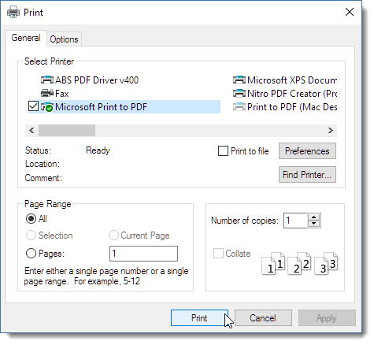
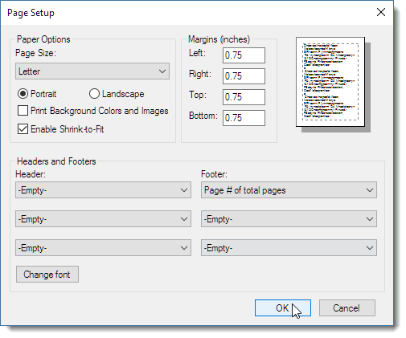

There are a couple of ways to print you HTML document to a Windows Printer or a PDF printer.

* Use the **Print** option from the **File** menu
* Open the Html Document in your system Browser  
and print from there

Markdown Monster allows you to print the preview output through the Web browser control that hosts the Preview document. You can use **File -> Print Output** to print the output from the current Html preview window to your printer or PDF document.

### Configuring Page Setup in Internet Explorer
Markdown Monster uses Internet Explorer via the Web Browser control, so while you can't configure print options in the dialog above, you can by opening a full version of Internet Explorer and use **File -> Page Setup** to configure the global Page Setup configuration. 

Any changes you make in this dialog also affect Markdown Monster's Html print output.

### Opening the Html Document in your Browser
Another option for printing output is to open the current preview document in your configured Windows default Web browser (*Ctrl-v-b*) and then print the document from there. Using a full browser you often get a few additional print options that are not available in the base print dialog described above, plus you can choose your favorite browser rather than Internet Explorer to print the document.

