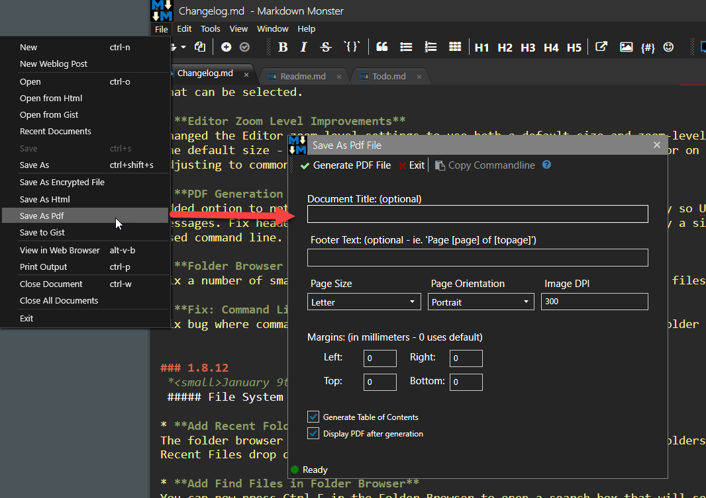
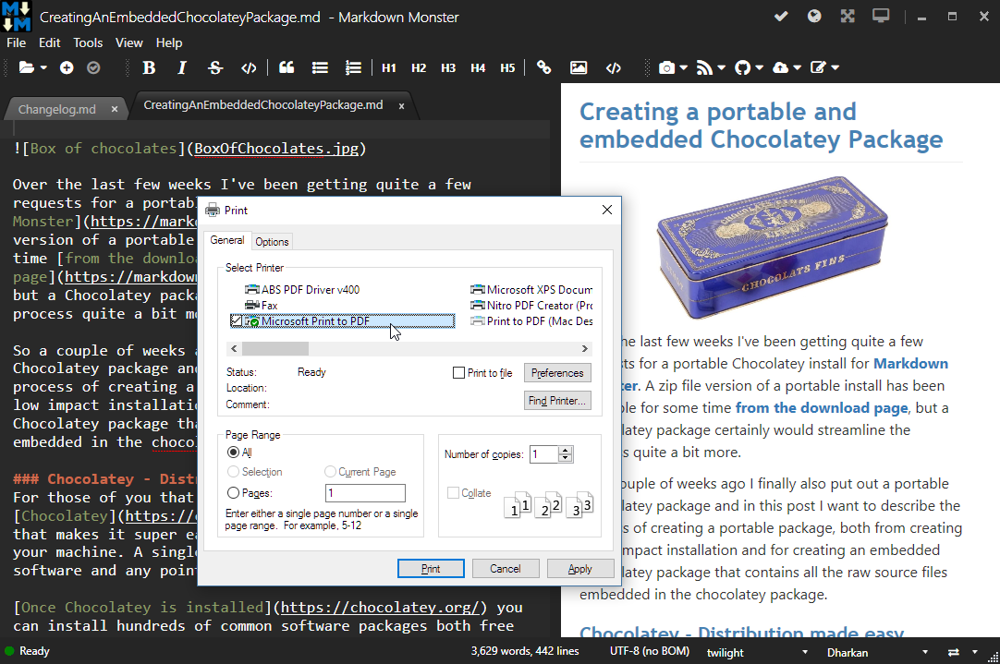
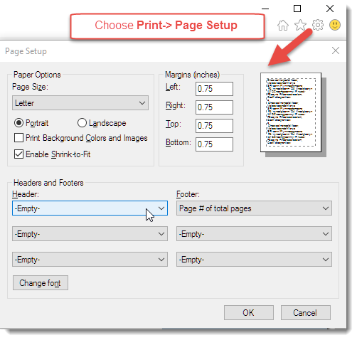

Markdown Monster creates HTML output when it transforms your Markdown document, and you can print the rendered HTML output to a printer or a PDF document.

There are a couple of ways to do this:

* Use the **File -> Save As Pdf** menu option
* Use the built in Print Functionality 
* Preview in your Browser and print from there

### Generating a PDF using the Save As PDF Menu
The easiest way to create a PDF document is to use this menu option:

Using this dialog lets you set a few opttions on your document. Most of the options should be obvious, but here are those that need a little explanation:

##### Title
An optional title header that is printed on the top of the document. If specified both the header is printed on the left and the current sub-section on the right.

##### Footer
An optional custom footer that is printed on the bottom of the page. If not specified the current page and total pages are printed in the lower right. If provided you can use [page] and [topage] to specify current page and total page count in the text.

##### Image DPI
Image DPI determines the image resolution of images embedded. The higher the DPI the bigger the document. If you create PDFs for computer reading only 150dpi or even 90 is probably good enough. The default is 300.

##### Display PDF after generation
If checked the PDF document is displayed in your system configured viewer. Note that if you generate the same file multiple times, that most viewers lock the PDF while displaying the document so before re-generating you should probably want to close your viewer.

### Built in Printing
You can use the built-in Print facility using **File -> Print Html Preview** or **Ctrl-P**. This essentially prints the output contained in the HTML preview window using the Internet Explorer Print Facilities.

There's more detail on the [Save Pdf Form in a separate topic](VFPS://Topic/_53U1B1DSC)o.

You can choose from any of the available printers on the list, which lets you print to a physical or virtual printer or a PDF driver like the **Microsoft Print to PDF** driver that is built in in Windows 10.

> #### @icon-lightbulb-o Tip: Configure HTML Printing in Internet Explorer Options
> The print dialog doesn't offer a lot of options and the default output annoyingly includes the HTML page's URL on every output page. 
>
> You can use the Internet Explorer Configuration options to remove the headers and footers for all printed output by going the **Page Setup** options:
>
> * Open Internet Explorer
> * Click on the Gear configuration icon
> * Select **Print -> Page Setup**
> * 
> * Set all the Headers and Footers to Empty
> * Optionally leave the Footer and show Page numbers
>
> This is a good idea in general for any HTML printing you do with Internet Explorer.

### Using an External Web Browser Instance
If you don't want to use the built-in printing based on Internet Explorer, you can also use an external browser, by choosing **File -> View in Web Browser** or **Alt-v-b** which opens your Windows configured Web browser.

You can then use that browser's print facility to print the document to a printer or PDF document and use your favorite browser's facility to perform print tasks.

Using a full browser usually has more options, and some browsers (ie. other than IE or Edge) offer a lot more print options and better true print output that matches your actual content especially if you are generating to PDF.

### Using the Pandoc Addin
We also provide a Pandoc Addin
