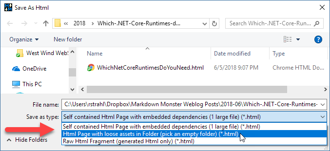

There are a number of different ways that you can export rendered your Markdown content as rendered HTML.

* Using the **File->Save As Html** Menu
    * Export as **Packaged HTML file**
    * Export as **HTML File with loose Assets**
    * Export the **Raw Html Fragment**
* Use **View In Browser** and **Save As Html** from Browser
* Use **Copy as HTML** to copy selected Markdown output to the Clipboard

### Using Save As HTML
This option lives at **File->Save as HTML** and it allows you to save your Markdown content as a rendered HTML in a few different ways:

#### Save as self contained HTML Page
Allows you to save the document as a **single large file** with all dependencies embedded into the single HTML document. All images, scripts, CSS, fonts etc. are embedded into the document as embedded binary data. Because of this this file can often be very large as all the support libraries like Bootstrap and FontAwesome are embeded.

Because the file is completely self contained in a single `.html` file you can move the file and it should render easily.

#### Save as HTML Page in Folder with Loose Assets
Allows you to save the HTML document to file, with all related dependencies copied to disk in the same folder. All images, CSS, Scripts and fonts are also created in the same folder.

> It's recommended that you create the generated HTML in a new empty folder so the HTML and its dependencies are easily isolated and can be zipped or moved as a group.

#### Save Raw HTML Fragment
You can choose the `Raw HTML Fragment` option if you want just the raw rendered HTML output from your markdown and save it to file. The output contains only the raw HTML fragment and does not contain the `<html>` and `<head>` sections.

### Copy As HTML
You can use the editor's Context Menu **Copy As Html** or **ctrl-shift-c** to copy the current Markdown selection as an HTML fragment to the clipboard. To select the entire document use **ctrl-a** then **ctrl-shift-a** to copy the generated HTML to the clipboard.

This can be quite useful if you want to use MM as your Markdown editor for pushing content into HTML based input controls.

### Exporting HTML using Browser Save As
The above options are native to Markdown Monster itself. The following is a technique you can use with your preferred browser, which may render the HTML differently and under some circumstances may do a better job with very complex HTML output.

To do this:

* Open your Markdown Document
* Make sure the Preview browser
* Use the Preview Browser's Context Menu:  
  **Show In external Web Browser** or  
  **View->View in Web Browser**
* HTML opens in Web Browser
* In the external browser choose Save As...
* Pick a file location and save
* Open the `.html` file from the local folder

Depending on the browser you get options to save a single document of just the HTML, or HTML plus all dependencies in a folder, similar to the behavior described for MM above.
