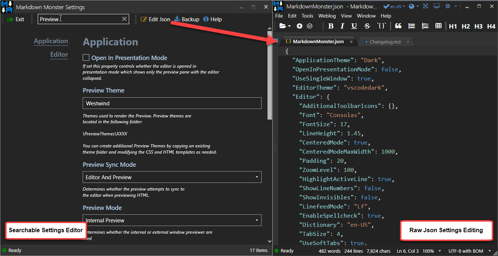

Markdown Monster is highly configurable and you can access most configuration settings directly from the Markdown Monster UI via **Tools -> Settings**:

### The Settings Editor
The Settings Editor provides searchable and grouped access to most configuration settings through an easy to use window interface. Type into the search box to filter the list of settings. Each option shows with information about purpose and behavior.

You can make changes to most settings and see the change immediately reflected in the editor.

### Editing Raw Json Configuration
You can also access the source configuration settings directly in raw JSON format via the **Edit Json** button in the above form. All settings in the form - plus a few additional ones - can be set directly in the JSON file. Any changes you make to the file are applied when you save the file.

### Live Changes
Any changes you make in the UI form or the file are **live and immediately applied**.  In JSON file mode changes are applied when you save the file, in the UI making the change immediately applies it. A handful of few settings like the Application Theme and top level template settings require a restart. 

For the UI form there's no undo, so be mindful. In file mode editing you can undo your changes and resave. The default location of the configuration file is:

`%appdata%\West Wind Markdown Monster\MarkdownMonster.json`

> #### @icon-info-circle Changing Configuration Folder to DropBox or OneDrive
> You can also change configuration folder using the **CommonFolder** setting in the Markdown Monster Settings at **Tools -> Settings**. For example, you can easily set the folder to a shared location like Dropbox:
`CommonFolder="C:\\Users\\rick\\Dropbox\\Markdown Monster Common"`

There are a ton of configuration values available and you can find more information what each settings does in the UI form which provides detailed information for each setting.

### Messed up the Settings? No Problem
If you managed to mess up the settings to the point that MM won't start or display, you can always reset your settings by:

* Running `mm reset` from the Windows Command Line
* Deleting the Configuration File at `%appdata%\Markdown Monster\MarkdownMonster.json`

### Configuration Settings
The easiest way to browse configuration settings and find out what they do is to use the Setting Form as it shows option along with the option description and behaviors.

For more info you can also look at individual settings here:

{{ Helpers.ChildTopicsList() }}