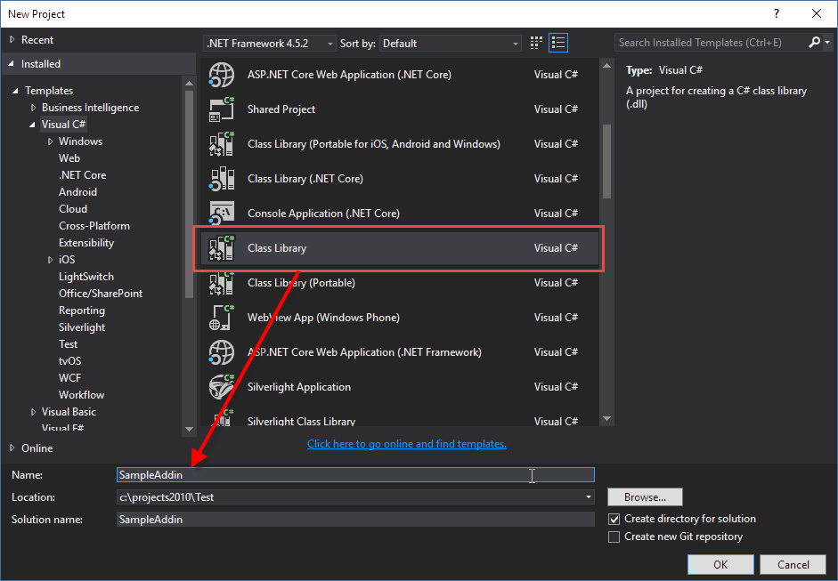
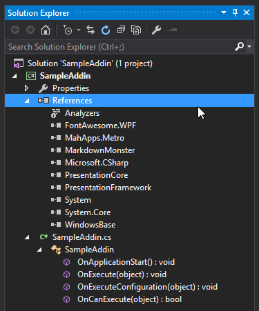
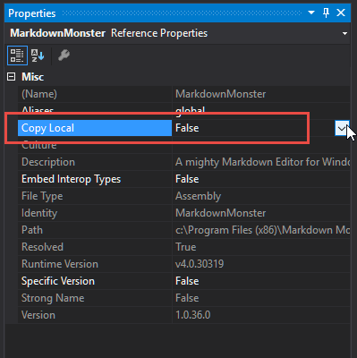
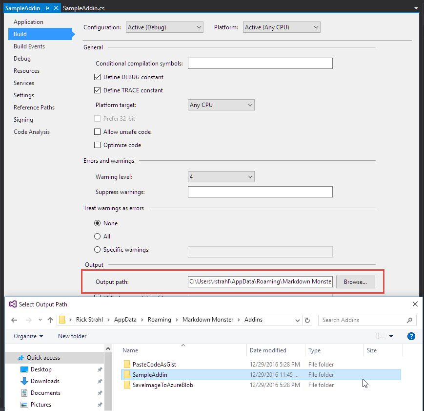
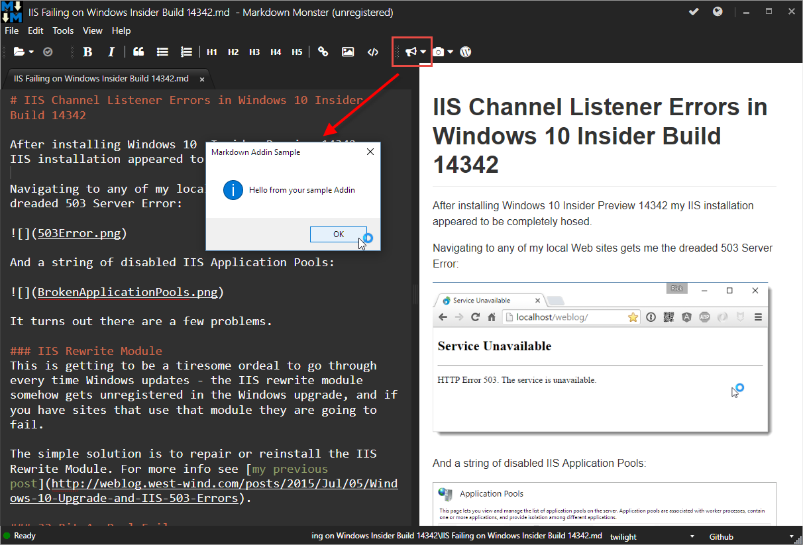
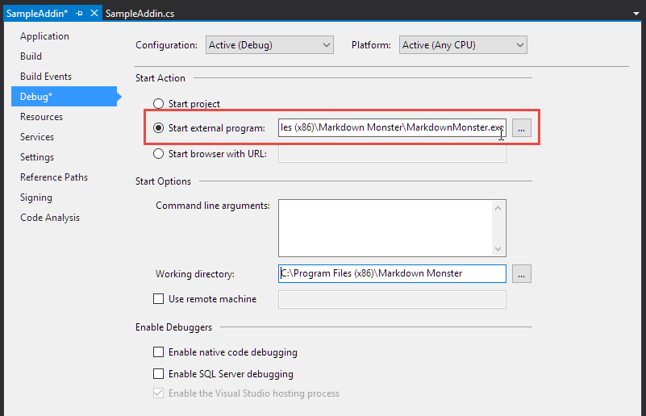
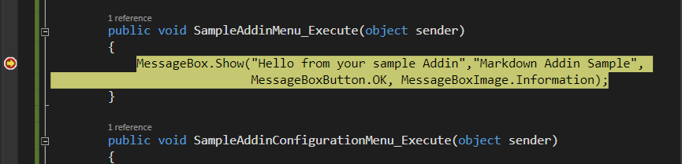

The base process for creating a new add-in is as follows:

* Create a new .**NET 4.6.2 Class Library Project**
* **Name your project so that it ends with *Addin* (ie. 'PushToGitAddin'),  
  so that the output DLL ends in `*Addin.dll`**
* Create a class that inherits from `MarkdownMonsterAddin`
* Set `Id` and `Name` properties. Ideally remove `Addin` from the Id
* Implement `OnApplicationStart()`
* Hook up an Add-in menu item (if you want UI)
* Attach event handlers that fire when add-in is activated

> #### @icon-info-circle Visual Studio Markdown Monster Addin Project Extension
> The following steps are complete manual steps, but you can also install the [Markdown Monster Addin Visual Studio Extension](https://marketplace.visualstudio.com/items?itemname=rickstrahl.markdownmonsteraddinproject), which sets up most of the initial steps for you: Creates a project, adds references to the appropriate assemblies and points the output assembly into the `%appdata%\Markdown Monster\Addins` folder. All you have to add is configure the debugging.

> #### @icon-info-circle Dependencies Location for the Addin
> When you create an addin you have to take various dependencies on Markdown Monster components. The Addin Project automatically sets those dependencies to the default Markdown Monster install location at `%LocalAppData%\Markdown Monster`. If you installed MM into a different location you will have to adjust those paths for the broken project references and point them at the appropriate assemblies in your custom install folder.

Note that the Addin Model also supports [non-visual addins](VFPS://Topic/_4UT0J9CM6) -- simply don't implement a menu item and the addin will only fire events and create no UI.

Let's go through these steps in detail.

### Create a new Class Library Project in Visual Studio
Start by creating a new Visual Studio Class Library project called **SampleAddin**:



Please make sure you target **.NET 4.6.2** or later as that's what MarkdownMonster.exe is built with. If you use an older version you won't be able to set a reference to the MarkdownMonster assembly.

### Add References to MarkdownMonster
Next you need to add a couple of references related to Markdown Monster to your project:

* MarkdownMonster.exe
* FontAwesome.WPF.dll   

These are required as they are used directly by the addin.

###### UI Libraries
If you plan on creating a WPF Window or other WPF UI for your Addin you need to add a few additional WPF libraries and the MahApps UI library which Markdown Monster uses for the Metro UI:

* MahApps.Metro.dll     (if you create Metro style windows)
* PresentationCore
* PresentationFramework
* WindowsBase

With the base references added here's what the project looks like:



### Copy Local False for Markdown Monster Assemblies 
Once added go into the project and Properties and set the **Copy Local** flag to **false** to any dependencies that are already loaded by Markdown Monster to avoid distributing files that already are loaded by MM. For all external base References set **Copy Local** to `false`:



By default when you build your addin the output should be only your assembly unless you explicitly add other libraries that Markdown Monster doesn't already use.

### Create your Addin Class
Next you need to create a class that inherits from the **MarkdownMonsterAddin** class. This class provides the base infrastructure and services to allow you to hook up your add-in and respond to events that are fired throughout the application lifetime.

The basic process is:

* Implement the OnApplicationStart() method
* In that method hook up the Menu handler to invoke your add-in
* Set up a click handler that fires on click
* Set up an optional CanExecute handler

The following is a basic implementation that shows a `MessageBox` when you click the main and configuration buttons:

```csharp
using FontAwesome.WPF;
using MarkdownMonster;
using MarkdownMonster.AddIns;

namespace MarkdownMonsterSampleAddin
{
    public class SampleAddin : MarkdownMonster.AddIns.MarkdownMonsterAddin

    {
        public override void OnApplicationStart()
        {
            base.OnApplicationStart();

            Id = "SampleAddin";

            // by passing in the add in you automatically
            // hook up OnExecute/OnExecuteConfiguration/OnCanExecute
            var menuItem = new AddInMenuItem(this)
            {
                Caption = "Sample Add in",

                // if an icon is specified it shows on the toolbar
                // if not the add-in only shows in the add-ins menu
                FontawesomeIcon = FontAwesomeIcon.Bullhorn,
            };

            // if you don't want to display config or main menu item clear handler
            //menuItem.ExecuteConfiguration = null;

            // Must add the menu to the collection to display menu and toolbar items            
            this.MenuItems.Add(menuItem);
        }
        

        public override void OnExecute(object sender)
        {
            MessageBox.Show("Hello from your sample Addin","Markdown Addin Sample",
                            MessageBoxButton.OK, MessageBoxImage.Information);
        }

        public override void OnExecuteConfiguration(object sender)
        {
            MessageBox.Show("Configuration for our sample Addin","Markdown Addin Sample",
                            MessageBoxButton.OK, MessageBoxImage.Information);
        }

        public override bool OnCanExecute(object sender)
        {
            return true;
        }
        
    }
}
```

Make sure the Addin builds at this point.

The key points are to create a menu item that is used on the **Tools -> Addins** menu popup and the main toolbar at the top of MM. You create a menu item with a caption and a FontAwesome icon. You pass in the addin which automatically attaches event handlers to the `OnExecute()`, `OnExecuteConfiguration()` and `OnCanExecute()` handlers of the menu. If you don't want to display the menu item or configuration option simply disable the event handlers on the menu item explicitly:

```csharp
// don't show Configuration drop down button
menuItem.ExecuteConfiguration = null;
```

To implement actual functionality you can override `OnExecute`, `OnExecuteConfiguration` and `OnCanExecute`. The main handler is the `OnExecute` handler where you can take action when the toolbar or menu item is clicked, which is the most common scenario.

Make sure the add-in builds at this point.

You can also optionally create or use a [configuration class](VFPS://Topic/_5520TLAV7) to persist and retrieve configuration values.

### Copy Output DLL to Markdown Monster `%AppData%\Addins` Folder
Addins run out of the `Addins` folder in the %AppData% folder **in their own dedicated folder**. 

* Create a new folder under  `%AppData%\Markdown Monster\Addins`
* Name it: `SampleAddin` in this case

You can then point your build output of your project into this folder:



Build your add-in and make sure the build still works.

### Test your Add in
At this point you should also be able to run your add-in. When you do, you should now see something like this:



Note the bullhorn icon in the toolbar on the right which is the custom icon for this add-in as specified in the initialization code. If you click it, you should see the dialog box as shown which verifies the add-in works. If you click on the down arrow next to the bullhorn you should see the second configuration message in a MessageBox.

### Debug your Add in
If you want to debug your add-in from Visual Studio you can set up the debugger to start `MarkdownMonster.exe` in the project's Debug options:



Set break points on both MessageBoxes in the sample add-in and run the project in Debug mode.

You should now see the debugger stop at the appropriate place in the code.



### And you're off to the Races!
And voila with that you've hooked up your Add-in. You can now run any .NET code necessary to manipulate the markdown content, bring up your own UI and or transfer rendered output to a server for example.

We'll look at some of the things you can do in the next topics.

* [Accessing and manipulating the Active Editor Document](VFPS://Topic/_4NF02Q0SZ)
* [Bringing up UI from your Markdown Monster Addin](VFPS://Topic/_4NE1CH7WA)
