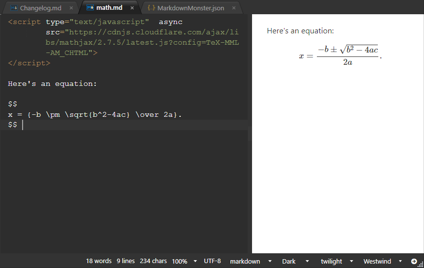

Math equations can be rendered in Markdown Monster and the generated HTML by using a Math processing library that is either added to the page, or to the Preview Template or your deployed site.

There are a number of libraries available and I use <a href="https://mathjax.org" target="top">MathJax</a> as an example in this topic.

### Embedding Math Expressions as Latex Text
You can use Latex style expressions which are the common way that Math expressions are created for HTML display. This is a bit hacky but you can do the following:

```markdown
< script type="text/javascript"  async          
        src="https://cdnjs.cloudflare.com/ajax/libs/mathjax/2.7.5/latest.js?config=TeX-MML-AM_CHTML">
</ script>

Here's an equation:

$$
x = {-b \pm \sqrt{b^2-4ac} \over 2a}.
$$ 
```

which renders as:



### Script in the Host Page
As an alternative you can embed the script tag into your host HTML Web page (or `preview.html`), but if the script is not embedded in the actual Markdown, the snippet won't refresh the equation as you type as a the script won't automatically detect the changed content. 

In that case you can Refresh the Previewer explicitly: In the preview window, right click and choose **Refresh Browser**.

### Allow Script Tags is Required!
In order for that to work you have to turn on "AllowRenderScriptTags": true in the Settings, so that script tags are allowed in the Markdown text. If that's not set the script tags are mangled to disallow script processing. The script needs to be in the page so that the previewer can refresh it.

In the future is there is more interest in this we may provide an easier way to integrate with this, but for now this explicit way to add a math library of your choice is required.