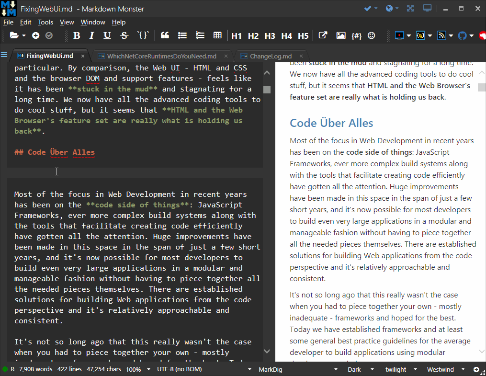
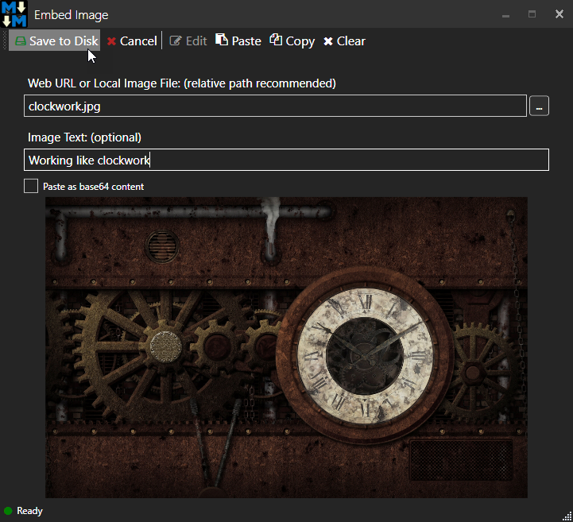
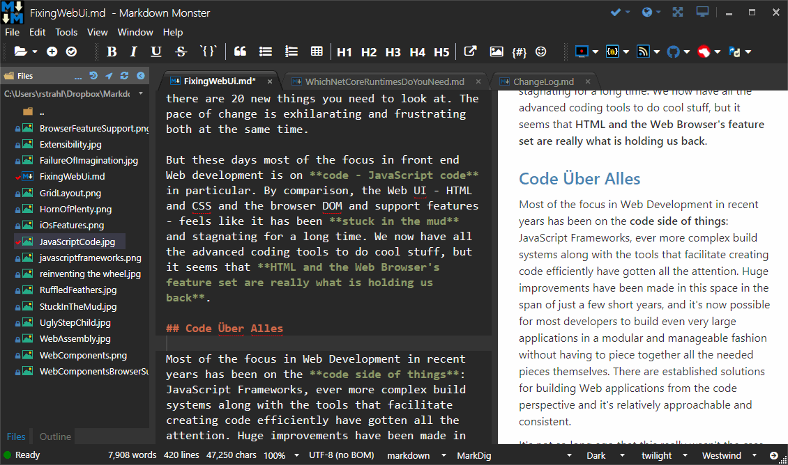
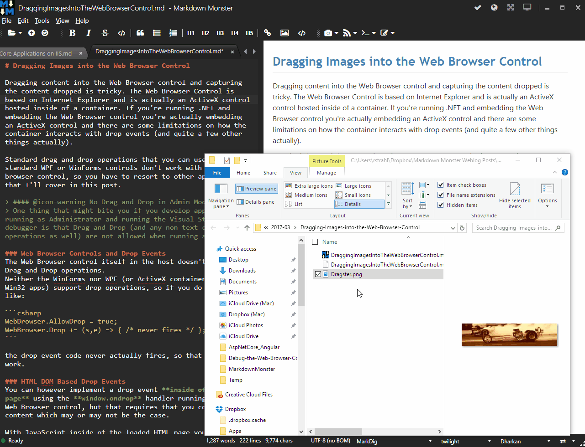
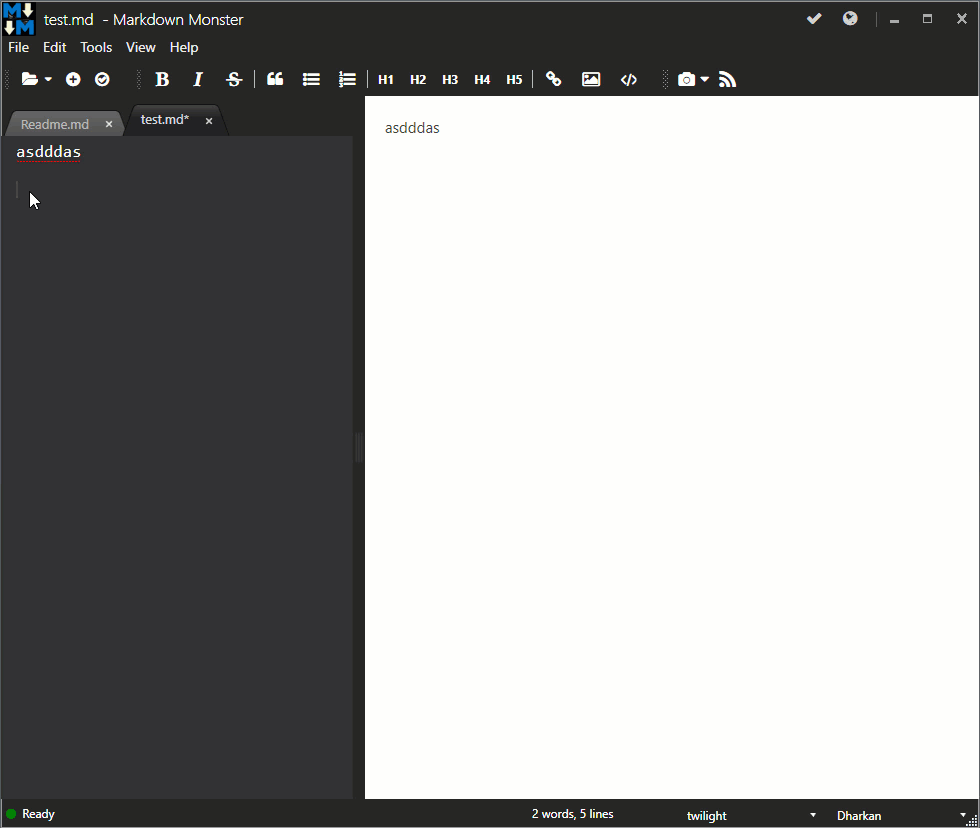

Image embedding is one of strongest arguments for using a dedicated Markdown Editor. Markdown Monster gives you lots of options to embed images into your documents:

* Using Markdown Syntax
* Paste Image from Clipboard
* Image Dialog
* Drag Images from the Folder Browser
* Drag Images from Explorer
* Screen Capture Addin

### Using Markdown Image Syntax
When linking local content that is **well** known and in a relative path, it's easy to simply type the image link directly into the Markdown document:

```markdown

```

The two parameters here are the optional title and image URL respectively. Typing is easy if you're familiar with Markdown, and the image is easily referenced as a local relative link from your document. 

### Paste an Image from the Clipboard 
A very common image use case is to capture images from other sources and paste them into the editor. It's easy to get images onto the clipboard from your Web Browser, screen capture, or simple Ctrl or Alt-PrtScrn to capture the desktop or active window.

If you have an image on the clipboard you can paste it into the document using **ctrl-v** or the editor context menu and **Paste Image**. When pasted MM asks for a file name to save to - by default in the same folder as the markdown document.



Images can be saved in a number of formats. Screen capture smallest as PNGs, while photos work best as JPGs. PNG images are automatically optimized for maximum PNG compression. JPG image compression can be set via the `JpegImageCompressionLevel` which defaults to `80`.

### Using the Image Dialog from the Toolbar
You can click on the **@icon-image Image** button in the Toolbar to activate the Image Dialog. Using this dialog you can add an image from a URL, from the file system or the Clipboard. If you pick from disk the image is optionally copied to the local or relative folder where the Markdown document lives. The dialog also automatically picks up clipboard images if no file is selected but an image is on the clipboard. Clipboard images can be saved to disk and embedded from here.



You can also use the **Edit** button to open the image in your configured editor which can be configured in the **Tools -> Settings** with the **ImageEditor** key.

### Drag Images from Folder Browser
Markdown Monster includes a File and Folder Browser that lets you browse files including images. You can click on the image to preview it, and click and hold to drag the image into the active document.



It's most useful for working with files in the current document directory and you can easily drag images from the folder browser into the editor. Images are automatically embedded at the cursor drop location. 

### Drag Image from Explorer
You can also drag an image from Explorer directly into a document. Simply pick a file in Explorer (or other Shell Explorer) and drag an image file into the editor. When the file is dropped MM prompts to save the file to disk, by default in the same location as the current document.




> Images dragged from sources up the folder hierarchy will prompt to save the image in a relative path.


### The Screen Capture Addin
You can also use the Screen Capture addin using the **@icon-rss Screen Capture** button on the toolbar to capture images from your screen, including mouse pointers and menus and using features like delayed captures so you can capture screen interactions like open menus and selections.



You can choose from the built in screen capture shown above, or using the built-in integration for popular <a href="https://www.techsmith.com/screen-capture.html" target="top">SnagIt Tool from Techsmith</a>

### Addin.OnSaveImage()  
It's also possible to override the above two behaviors by creating an add-in that overrides the **OnSaveImage()** method. The method is passed either a string with a filename or a Bitmap and the add-in can then decide on how to manage the save operation. For example, you could create a save handler that automatically saves to Azure Blob storage or an Imgur image save operation.

### More in a Blog Post
For a more detailed look at image saving options, see this very detailed blog post:

<a href="https://medium.com/markdown-monster-blog/getting-images-into-markdown-documents-and-weblog-posts-with-markdown-monster-9ec6f353d8ec#.6xfftzuwy" target="top">Getting Images into Markdown Documents and Weblog Posts with Markdown Monster</a>

