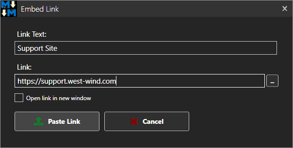

You can embed links into document content in two ways:

* Use Markdown Syntax
* Use HTML Syntax
* Use the Link Dialog

### Using Markdown
To embed links into a topic you can either use the markdown syntax like this:

```markdown
[Go to the Support Web Site](https://support.west-wind.com)
```

or for local links:

```markdown
[Download Page](./product/download.html)
```

### HTML Syntax
Markdown also supports HTML so you can also use raw HTML text to embed links. This is useful if you require `target` links or need to add alignment styling.

```markdown
<a href="./product/download.html" target="_top">Download Page</a>
```

### The Paste Link Dialog
Alternately, you can use the **Link Dialog** by clicking on the @icon-external-link on the toolbar.

The Paste Link dialog lets you interactively create a link to paste into your content. Here's what the dialog looks like:



For the Link you can either type in or paste a URL or use the file selection button pick a local file resource to link. Any local file resources will be linked as relative if possible.

### Automatic URLs from Clipboard
If you have a URL on the clipboard when the dialog is first opened, the URL is automatically placed into the **Link** field. 

If you navigate off the form and copy a URL to your clipboard then return to the form, if the **Link** field is still empty it is then automatically filled from the Clipboard URL.
