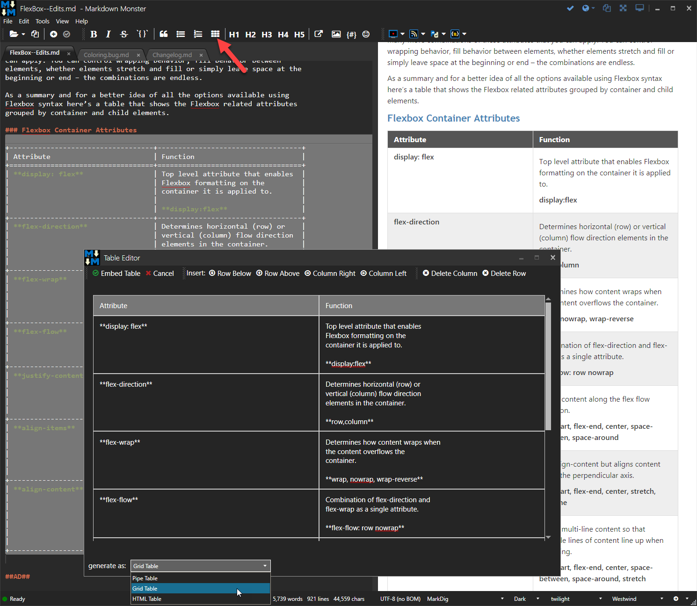
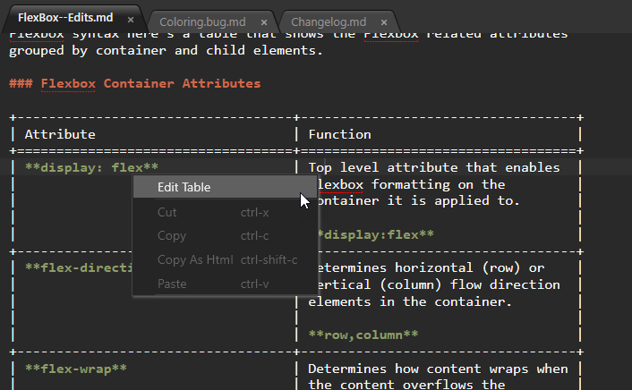
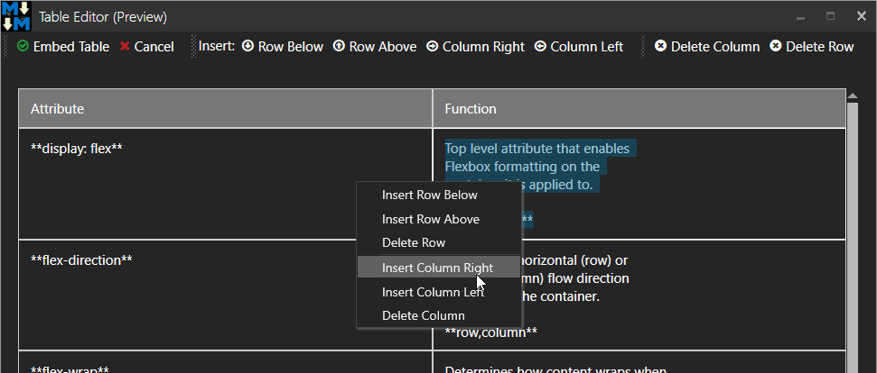

Markdown Monster includes a **Table Editor** that makes it easy to create Markdown table content more interactively.

### Features

* Interactive cell editing
* Tabbable interface - tab to next field
* Auto-inserted columns - tab after last field
* Easy to insert and delete rows and columns
* Support for **Pipe**, **Grid** and **HTML** tables
* Two-way editing - edit existing Markdown Tables in editor
* Formatted Markdown or HTML output (up to certain column widths)

### Screen Shots
Here's what the Table Editor looks like:



You can also edit tables once they've been created and re-open them in the editor to add content or simply reformat them.



While editing a table you can use the Toolbar or Context menus to manipulate the table contents by adding and removing columns:




### Data Entry
The first row of the table is considered the **Header** and it is required! The first row is **always** the header for the table.

Any subsequent rows are standard row content and you can have as many rows and columns as you'd like to use. 

When new columns are added new columns are automatically sized to equal widths in the edit table. Actual rendered HTML output will autosize to accomodate whatever content is used.

### Table Types
The table editor can generate Markdown compatible output to:

* [Pipe Tables](https://help.github.com/articles/organizing-information-with-tables/)

```markdown
| Right | Left | Default | Center |
|------:|:-----|---------|:------:|
|   12  |  12  |    12   |    12  |
|  123  |  123 |   123   |   123  |
|    1  |    1 |     1   |     1  |
```

* [Grid Tables](http://pandoc.org/MANUAL.html#extension-grid_tables)

```markdown
+---------------+---------------+--------------------+
| Fruit         | Price         | Advantages         |
+===============+===============+====================+
| Bananas       | $1.34         | - built-in wrapper |
|               |               | - bright color     |
+---------------+---------------+--------------------+
| Oranges       | $2.10         | - cures scurvy     |
|               |               | - tasty            |
+---------------+---------------+--------------------+
```

* **HTML Tables**

```html
<table>
<thead>
	<tr>
		<th>Header 1</th>
		<th>Header 2</th>
		<th>Header :</th>
	</tr>
</thead>
<tbody>
	<tr>
		<td>Column 1</td>
		<td>Column 2</td>
		<td>Column 3</td>
	</tr>
	<tr>
		<td>Custom Table Content</td>
		<td>Column 4</td>
		<td>Column 5</td>
	</tr>
</tbody>
</table>
```

> #### @icon-warning Markdown Support for Tables
> Not all Markdown parsers support table syntax other than HTML tables. GitHub supports Pipe tables and HTML tables only for example, but it all depends on the target platform that is rendering the Markdown text.

### Pipe Table Column Alignment
If you're using **Pipe Tables** you can use pipe alignment options in the header columns by pre- and post-fixing the **header text** with colons.

* `:Left Aligned`
* `Right Aligned:`
* `:Center Aligned:`