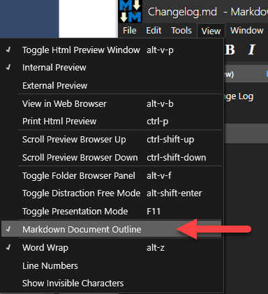
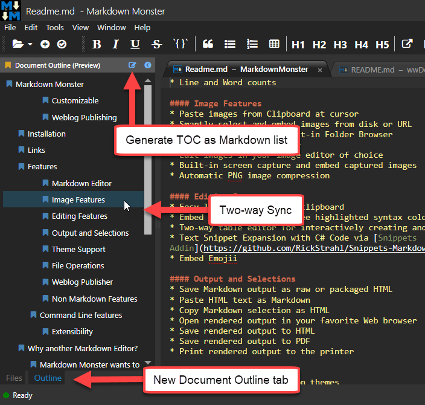
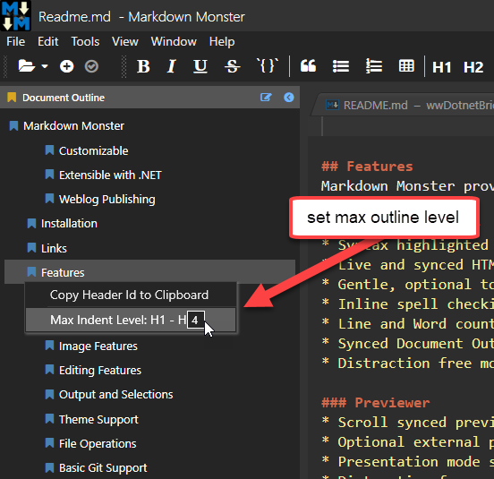

You can use the Document Outline panel to navigate your open Markdown documents and generate a Table of contents for longer documents at the cursor position.

### Toggling the Document Outline
To toggle the Document Outline availability you can use **View -> Document Outline** toggle to turn the outline panel on or off.



### Navigation and the Document Outline
The primary use for the Document outline is to provide quick document navigation and MM provides a view of all the **H1** through **H4** headings in a pseudo hierarchical view.

You can click on any entry to navigate to that part of the document quickly. In reverse, navigating the Markdown document in the editor keeps the Document Outline in sync to the nearest header above.

Here's what the Document Outline looks like:



The window is available only on Markdown documents and disappears on non-Markdown docs.

### Embedding a Table of Contents
The @icon-edit button in the toolbar lets you generate a Table of Contents as a list of Markdown links that point to the internal links of the page. 

The TOC is embedded into the Markdown document as a list of markdown tags delimited by HTML comments that identify the table of content and allow the TOC to be replaced on subsequent re-generation.

Here's an example of a generated TOC:

```markdown
<!-- Start Document Outline -->
* [Markdown Monster](#markdown-monster)
	* [Weblog Publishing](#weblog-publishing)
	* [Installation](#installation)
	* [Links](#links)
    * [Show your Support](#show-your-support)
	* [Features](#features)
		* [Markdown Editor](#markdown-editor)
			* [Image Features](#image-features)
			* [Editing Features](#editing-features)
			* [Output and Selections](#output-and-selections)
			* [Theme Support](#theme-support)
			* [File Operations](#file-operations)
			* [Weblog Publisher](#weblog-publisher)
			* [Non Markdown Features](#non-markdown-features)
		* [Command Line features](#command-line-features)
		* [Why another Markdown Editor?](#why-another-markdown-editor)
	* [Acknowledgements](#acknowledgements)
	* [Spread the Word about Markdown Monster](#spread-the-word-about-markdown-monster)
	* [License](#license)
		* [Contribute - get a Free License](#contribute---get-a-free-license)
		* [Warranty Disclaimer: No Warranty!](#warranty-disclaimer-no-warranty)
<!-- End Document Outline -->
```

You can update the outline at any time and will be prompted if a TOC already exists. If you continue, the existing document TOC is replaced with the new current updated one.

### Setting the Max Outline Level
The default max outline level is `H1` - `H4` meaning all headers up to **H4** are included in the outline and Table of Contents creation, but **H5** and **H6** are not.

You can customize the outline level via the `MaxDocumentOutlineLevel` configuration switch in `MarkdownMonster.json` or by using the Document Outline context menu:



The textbox lets you type in a number between 1 and 6 to specify the max outline level.
