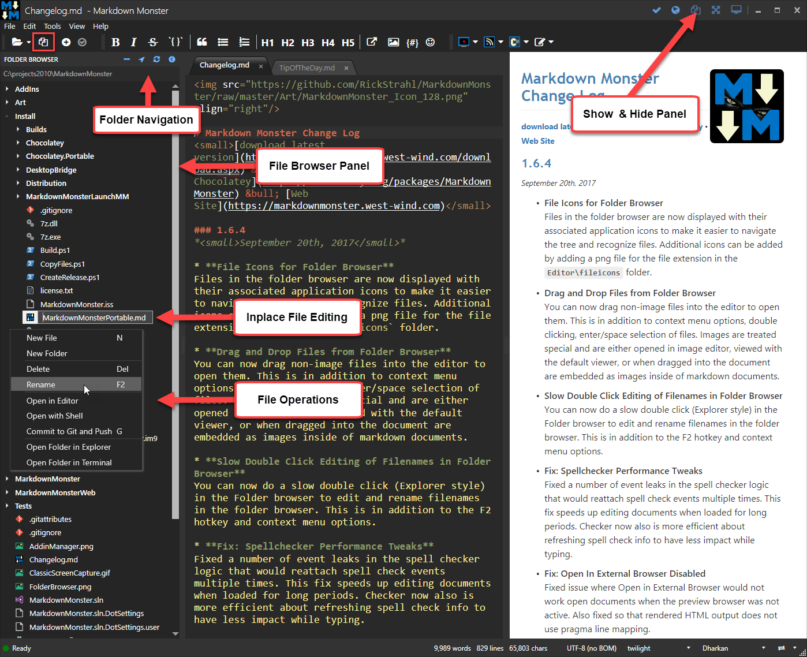

The slide out Folder Browser allows you quickly browse, open and manipulate files and folders in the Windows file system.

To access the Folder Browser use the **@icon-files-o icon** on the toolbar on the right, or in the Window control box at the top left of the main window. You can also use a keyboard shortcut: **Alt-a-f**.

### Features
Using the File Browser you can:

* Browse files
* Open or drag and drop supported file formats in the editor
* Preview Images (just hover)
* Open Images into your configured Image Editor
* Open or drag images into document as image links
* Open files using the default application (ie PDF's in PDF View, Images in Image Viewer etc.)
* Quickly create new files
* Easily rename and delete files
* Open a Console or Explorer in selected folder
* Commit selected file to Git

Here's what the Folder Browser looks like:

### Opening Folders
There are a number of ways to open a folder for the folder browser:

* Type a folder name into the Textbox above the list
* Click the  @icon-ellipsis-h icon to pick a folder
* Click the @icon-location-arrow icon top open the active document's parent folder

### Opening Files
You can **double click** or **press Enter** on any file to open it. If the format is one that Markdown Monster knows how to work with the document is opened in the editor. You can also simply drag a file into the editor window and it will open there if has one of the supported file extensions

### Images
You can preview images by hovering over them in the browser. Images can be viewed or edited using **Show Image** or **Edit Image** and you can **drag images** images into an open Markdown document to create an image reference in the document.

Images are opened in the configured image editor (set via the **ImageEditor** configuration setting). jpg, png, and gif images are supported for this operation.

### Unsupported Files
All other files are sent to the standard Shell mapping and displayed in the configured viewer. Executable files are not allowed to be executed.

### File Management
The short cut menu in the TreeView allows access to the following file operations:

* Create a new File or Folder
* Rename an existing file
* Delete a file

### Open Terminal or Explorer
You can also open a Command prompt or Explorer window at the selected file location. Terminal uses the **TerminalCommand** and **TerminalCommandArgs** configuration settings to start a command prompt. The Explorer link simply opens the Windows File Explorer in the specified location.

### Commit to Git and Push
You can also optionally commit the selected file to Git. If selected the current file only is committed and optionally pushed to the server, depending on the `GitCommandBehavior` setting (`CommitAndPublish` or `Commit`)

### File Icons
The browser automatically displays icons for most common types of files.

You can optionally disable this feature by setting `FolderBrowser.ShowIcons: false` in the configuration file. Turning off icons can make the file browser run slightly faster.

You can also add icons for other file formats by adding a 32x32 PNG file with the extension name into the `Editor\fileicons` folder.