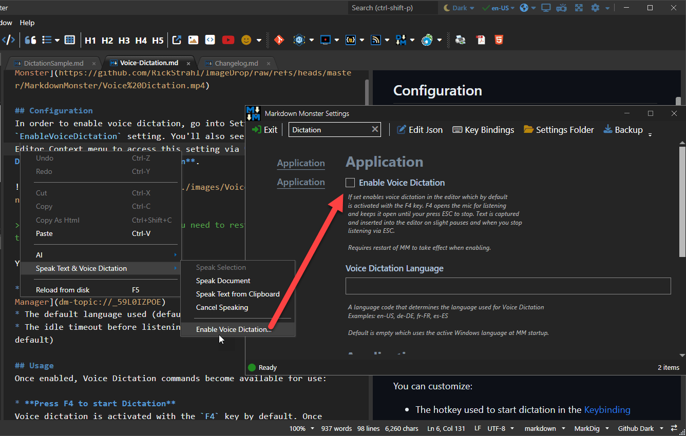
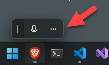

Voice dictation allows you to speak text and turn that the captured speech into text in the Markdown Monster editor.

## Usage
[Once enabled](#configuration), Voice Dictation commands become available for use:

* **Press F4 to start Dictation**  
Voice dictation is activated with the `F4` key by default. Once activated the mic is open and you can dictate your spoken text into editor. While actively listening, dictation waits for a second or so of silence before capturing spoken text text into the editor.
   > You can customize the Start Dictation shortcut key in [Markdown Monster's Keybindings](dm-topic://_59L0IZPOE). Stop Dictation (`ESC`) is not customizable.

* **Press ESC to stop Dictation**  
Dictation and listening to the mic microphone is turned off by pressing the `ESC` key.

* **Dictation Stops after 1 minute of Silence**  
If you don't speak for 1 minute while dictation is turned on, listening is turned off after this timeout and you have to restart it explicitly again.

In addition to the hotkeys you can also start and stop and cleanup via:

* **Editor Context Menu Options**  
The Editor context menu can set the above options via the **Speak Text & Voice Dictation** sub-menu. There are options to **Start Voice Dictation** and **Stop Voice Dictation** and to **Cleanup Dictation Text from Selection**.

* **Command Palette**  
The Command Palette (`Ctrl-Shift-P`) has **Start Dictation**, **Stop Dictation** and **Cleanup Dictation Text** commands for direct access to dictation features. 

* **Hotkey Configuration for Start Dictation**  
You can customize the Start Dictation shortcut key in [Markdown Monster's Keybindings](dm-topic://_59L0IZPOE). Stop Dictation (`ESC`) is not customizable.

### Cleaning up Dictation Text via AI
The dictation engine is pretty good at understanding spoken text and minimal context and it does a good job of capturing text accurately even in low quality mic environments. But the engine doesn't automatically handle punctuation, capitalization and sentence breaks. 

You can explicitly speak punctuation like `period`, `comma`, `question mark` etc. and these values are approprately inserted into the text as you dictate. But text is not automatically terminated, nor are commas placed where they should be automatically.

To help clean up text quickly you can use the AI aided **Cleanup Dictation Text from Selection** function.

This feature requires that you configure an OpenAI provider using either an online or local OpenAI API via [OpenAI configuration](dm-topic://_6Y41CLPFE) using a BYO model/key. Our implementation supports both online and local models (ie. [Ollama](https://ollama.com/)) as long as the API supports OpenAI.

If configured you can use the **Cleanup Dictation Text from Selection** option to clean up the entered text:

The result is displayed in a visual diff comparison view that shows the original text and the modified text side by side with changes highlighted. You can modify the checked text in the bottom pane - the text on the bottom is what's pasted into the editor if you accept the changes.

> This feature is very similar to the AI based grammar checking in **AI -> Check Grammar of Selection**, but it includes a few additional prompt hints specific to dictation input.

### Dictation Keywords
In addition to built in punctuation support in the Windows native engine for things like **Period**, **Comma**, **Question Mark** etc. in the native language, there are a few key additional words that you can use with dictation:

The following keywords only work in the English language:

* `Space` - adds a space at the cursor
* `Line Feed` or `Return` - adds a line break
* `Stop Recording` - stops listening

These key words must be spoken on their own **after any other captured text has been filled** in order to perform their specific operation.

## Configuration
In order to enable voice dictation, go into Settings and set the `EnableVoiceDictation` setting. When not enabled, you also see an option in the **Editor Context menu** to access this setting via **Speak Text & Voice Dictation -> Enable Voice Dictation**.

> When enabling Voice Dictation you need to restart Markdown Monster to take effect.

You can customize:

* The hotkey used to start dictation in the [Keybinding Manager](dm-topic://_59L0IZPOE)
* The default language used (default to current Windows language)
* The idle timeout before listening stops automatically (1 minute by default)

### Language Support
By default Voice Dictation uses the **active Language when Markdown Monster was launched** for capturing dictation text.

However, you can also change to an explicit language via the `VoiceDictationLanguage` configuration switch. Choose a culture-language pair like `en-US`, `de-DE` or `de-AT` or `fr-CA` to specify a specific language. 

Leave the value empty (or null in JSON) to go back to the default Windows language.

### System Requirements
In order to use Voice Dictation a couple of Windows System settings have to be enabled:

- Turn on **Online Speech Recognition** <small>*(on by default)*</small>
- Turn on Microphone Access in **Microphone Privacy Settings**

The dictation engine automatically pops up the Microphone Privacy Settings dialog if Microphone access is not allowed when you try to use dictation.

### Voice Dictation Troubleshooting
Voice dictation is implemented via Windows Media services and these services are not always reliable interfacing with Audio hardware. 

Assuming Voice Dictation is enabled, you will see the Windows Voice Icon show up on the desktop as a floating window:

If you click on the ... you can configure audio sources and a few other settings.

If for some reason recording does not work, you can reset the audio engine by disabling it and turning it back on. 

You should also check and make sure your default microphone is showing in the list of audio inputs - the most common problem I've seen is that the input source switched to another inactive recording device.