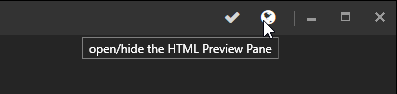
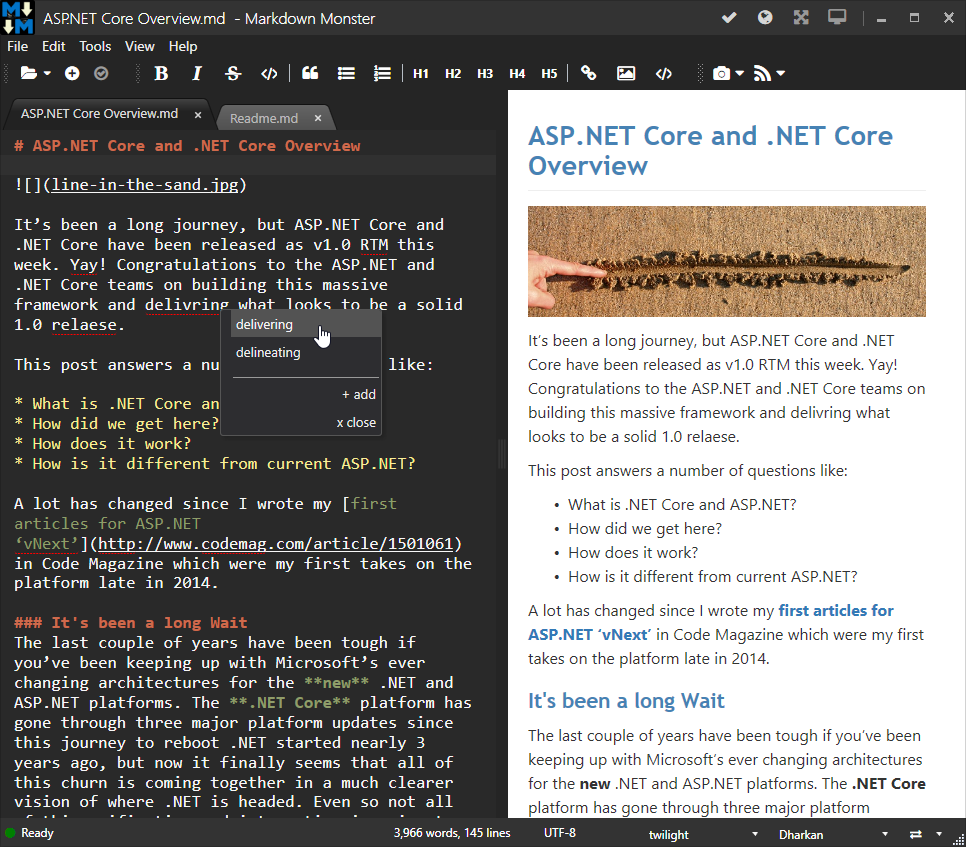
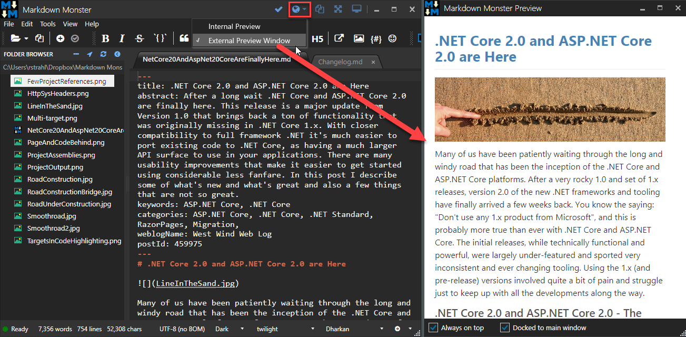
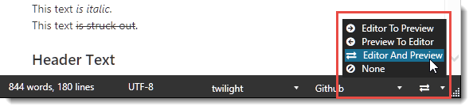

Markdown Monster's Preview Pane lets you check out what your markdown text will look like when it's rendered to HTML.

The editor has a few special commands that affect the way the preview pane is handled:

* Preview Toggling
* Preview Location (Internal or External)
* Preview Refresh
* Preview Scrolling

### Preview Toggling
Markdown Monster's editor supports previewing of Markdown and HTML content as rendered HTML. The preview window can be toggled in several ways:

* Preview Toggle @icon-globe in the top Window menu next to the close box   

* On the View | Html Preview Menu option
* Using the **Alt-V-P** shortcut

Any of these options will toggle the Preview Pane on and off if you are editing a Markdown, HTML or **untitled** (New) documents. 

Markdown Monster supports editing a variety of text file formats, but on HTML and Markdown documents present the Preview Pane - for all others toggling has no effect and there is no preview pane.

### Preview Location
By default the preview Window is located **inline** of the main Markdown Monster window:

Optionally you can also use an **external window** for the preview:

To switch between modes use:

* **Views->Internal Preview** or **Views->External Preview Window**
* The dropdown next to the Globe icon on the top right

### Preview Refresh
In order to keep the editor responsive while typing the preview window is updated whenever you **stop typing for 1 second**. This makes for optimal typing speed while still giving a reasonably real time text update for your Preview form.

You can also explicitly force the preview to refresh by **Saving (ctrl-s)** the current document, or by explicitly pressing the refresh key combo of **Ctrl-Shift**.

### Preview Scroll Sync
The preview scroll position can also be optionally synced with the editor and vice versa. There are 4 options for syncing:

* EditorToPreview
* PreviewToEditor
* EditorAndPreview
* None

The setting can be configured in **Settings** with the `PreviewSyncMode` property or by using the rightmost statusbar icon dropdown:

> ### EditorAndPreview Sync Jitter
> When you have preview mode to **EditorAndPreview** you may find that occasionally the editor might jump unpredictably or the editor won't line up properly. This can happen when working with images or code blocks (or any other non-text objects) when the previewer can't find an appropriate element to sync to. 
>
> We recommend you primarily work in **EditorToPreview** mode, and turn on **EditorAndPreview** mode for specific tasks when reviewing documents. Note that you can scroll the editor to also scroll the preview so that might be enough for all situations as well.

### Preview Scrolling
You can also scroll the Preview Window while in the editor using a couple of key board shortcuts:

* **Ctrl-Shift-Up** scrolls the Preview up 
* **Ctrl-Shift-Down** scrolls the Preview down

These keys make it easy to quickly shift the Preview pane to the content you are working on without taking your hands off the keyboard.

