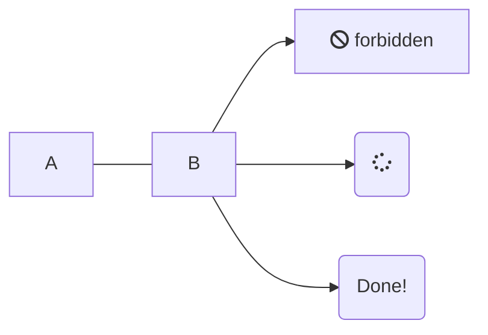

You can embed <a href="https://mermaidjs.github.io/" target="top">Mermaid Charts</a> content into a Markdown document in Markdown Monster using either a Mermaid Markdown Code Snippet or using their Raw Html Syntax. Markdown Monster can preview the resulting chart in the previewer.

Here's what the **Mermaid Markdown Syntax** looks like:

~~~~markdown
 ```mermaid
 graph LR
   A --- B
   B-->C[fa:fa-ban forbidden ]
   B-->D(fa:fa-spinner)
   B-->E(Done!)
 ```
~~~~
<small>***Note:** There's an extra leading space in Markdown examples to avoid rendering the code block into Mermaid.*</small>


which renders:



Alternately you can use the **Raw Html Syntax** that Mermaid natively uses:

```html
<pre class="mermaid">
graph LR
  A --- B
  B-->C[fa:fa-ban forbidden]
  B-->D(fa:fa-spinner)
  B-->E(Done!)
</pre>
```

Here's what Mermaid content looks like in the internal preview and previewed in Chrome:


> #### @icon-warning Raw Html Syntax does not Html Encode
> Note that if using the RawHtml syntax `<pre class="mermaid">`, the Mermaid content between the brackets **is not Html Encoded**. This means you need to escape brackets inside of the block with `< >` with `&lt; &gt;`, double quotes `"` with `&quote;`, ampersands with `&amp;` etc.
>
> Therefore it's recommended to use the triple tick `mermaid` syntax, since it handles the proper encoding automatically.

### Enabling and Disabling Mermaid Rendering
Mermaid rendering is enabled by default in `v2.7.5` and later. The setting is configurable as it adds a little overhead for checking for the Mermaid tags in content and requiring a large linked  dependency if Mermaid content is found.

In order to enable or disable Mermaid diagram rendering in Markdown Monster you need to:

* Enable **Mermaid Rendering** (**Tools | Settings | Mermaid Diagrams**)
* You have to **restart Markdown Monster** for the change in settings to take


> #### @icon-info-circle Specify Mermaid Script Version  
> You can specify a **specific version of Mermaid** using the `MermaidDiagramsUrl` configuration setting. By default MM uses the latest, un-numbered version. 


If you're pasting a mermaid chart for the very first time into a document, the chart won't render because the associated script is not in the page. By default MM caches pages and replaces only the content in order to provide smooth updates. However, in this scenario the Mermaid script is not loaded which means  no preview. There are several ways around this:

* Refresh the Browser (f5 or Refresh Browser from context Menu)
* Activate another tab then back to the tab with Mermaid
* Enable the `AlwaysUsePreviewRefresh = true` Configuration setting

Once Mermaid is enabled, MM automatically checks for Mermaid tags in the document and if it finds them adds the Mermaid library to the current page. It then renders the chart content using the standard Mermaid Charting syntax **for its preview rendering**.


### JavaScript Code Required to Render Mermaid Charts in your own Html
Markdown Monster automatically **adds the necessary script to execute Mermaid chart to display diagrams in the previewer**.  There's nothing else you need to do for previewing Mermaid.

But **this specific preview implementation is specific to Markdown Monster**, and not part of the raw Html or Markdown output - that is up to the hosting application that you plan to use the Markdown or rendered Html in which has to support Mermaid rendering.

Some platforms like GitHub and GitLap - like Markdown Monster - automatically detect Mermaid and add the appropriate scripts to render charts.

But if you use the Markdown in your own pages outside of Markdown Monster or a platform that support Mermaid, you will have to add the required script code to your own pages in order for Mermaid to render properly.

We recommend you do this conditionally based on content containing mermaid. For example, in my documentation solution I check whether the rendered content includes mermaid text and only if it does do I inject the mermaid code into the page.

```html
{{% if (Topic.Body?.Contains("\n```mermaid") ?? false) { }}
    <!-- only load when needed since this script is huge -->
    <script id="MermaidScript"
            src="https://cdn.jsdelivr.net/npm/mermaid/dist/mermaid.min.js"></script>
    <style>
    pre.mermaid {
        border: none !important;
    }
    </style>
    <script>
    mermaid.initialize({startOnLoad: true});
    </script>
{{% } }}
```
If you refresh the page on the client side, you also need to handle updating the Mermaid charts via JavaScript:

```html
<script src="https://cdn.jsdelivr.net/npm/mermaid/dist/mermaid.min.js"></script>
<script>
mermaid.initialize({startOnLoad:false});
</script>

<script>
// reloads a chart on the page
function renderMermaid(){
    mermaid.init(undefined,document.querySelectorAll(".mermaid"));
}
// application event that triggers a refresh
$(document).on('previewUpdated', function() {        
   renderMermaid();
});
```

### Generating Mermaid in Output
If you want to generate Mermaid output that is properly rendered there are a couple of ways you can do this:

* Print to Pdf 
* Save As Html (self-Contained or loose files dependencies)

#### Print to Pdf
Pdf output can be generated with Markdown MOnster, but Mermaid diagrams will only work if you use the **Print to Pdf** feature, rather than the **Save As Pdf** functionality. The  **latter will not work** with Mermaid diagrams, while the **former does work**
to capture the Mermaid charts in Pdf. Print to Pdf uses graphics rendering of page output so it is more flexible for script generated output like Mermaid and MathML as opposed to the text/script based rendering in the Save As Pdf feature.

To use this feature:

* Make sure the Html Preview is active
* Use the Context Menu
* Use the **Print** Option
* Select **Save As Pdf**
* Pick a file name to save to


#### Export to Html
In order to export a page with Mermaid content you'll need to export including all of the related resources in the page, which includes the very large Mermaid library.

To use this feature:

* Make sure the Html Preview is active
* Use the Context Menu
* Use the **Print** Option
* Select **Save As Html**
* Select **Save As Type** Self-Contained, or Loose Files, or Zip
* Pick a file name to save to

If you choose self-contained the file will be **very large** due to the size of the Mermaid library. If you choose loose files all the files will be stored in a folder, or a zip file if you chose the Zip file option.