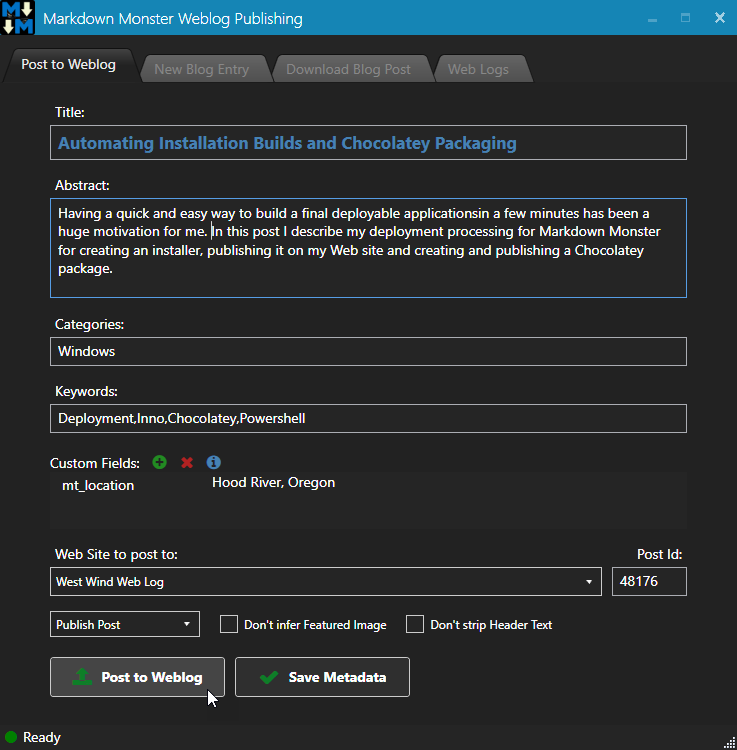
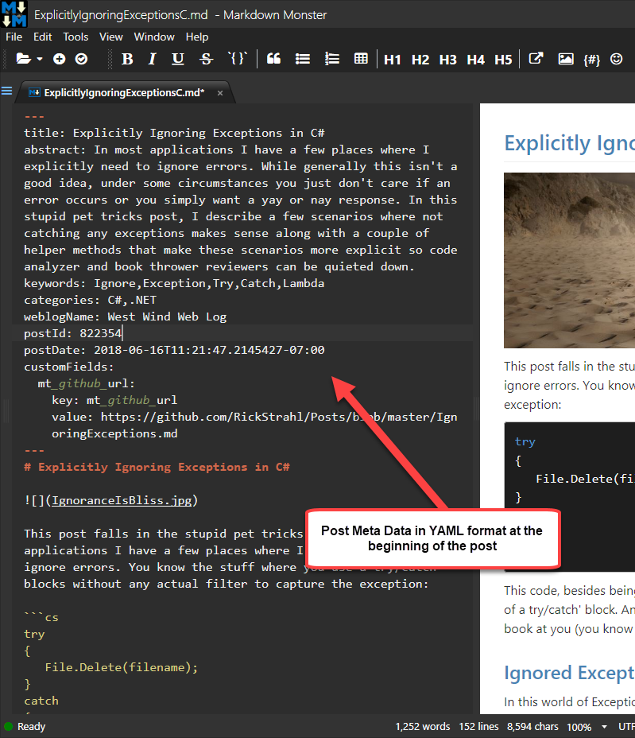

The Weblog Publishing add-in lets you publish the rendered content from the active Markdown document to a <a href="https://codex.wordpress.org/xml-rpc_metaweblog_api" target="top">MetaWebLog API</a> or <a href="https://wordpress.com/" target="top">WordPress</a> enabled Web site. 

To do this:

* Simply edit your Markdown
* Preferably link any images from a relative folder
* Click the Weblog @icon-rss button in the Toolbar 

This should bring up the Weblog Addin forma which provides the following features:

* Posting to a Weblog
* Managing your Weblogs to publish to (add, edit, delete)
* Create a new Blog Entry (creates new doc and folder)
* Download existing Blog Posts

### Publishing a Blog Post
There are two ways you can publish a blog post: 

* Use an existing Markdown Document
* Create a new Blog Post

In Markdown Monster a blog post is simply a markdown document with some associated meta data attached at the end of the document. You can take an existing document and publish it as a Weblog post or you can have Markdown Monster create a new file in a new folder so you can keep all related resources like images in a single location. We recommend you use the latter but it's not necessary.

When a Markdown document is published as a blog post, a bit of Meta data that contains the text that you enter on this form is stored:

When you publish your post or you click on the **Save Metadata** button, a small snipped of hidden text is added to your markdown document as an HTML comment:

The post metadata includes all the info you entered in the dialog and is in a pseudo xml format wrapped in an HTML comment block to hide it from the document. When you later re-open the window to re-publish your entry this data is preloaded into the dialog and saved when you exit.

> **Note:** The meta data is stripped out before your post is published to the server.

When the post is published to the blog the meta data is parsed and injected into the API request to the server to tell it about the post to be posted using either **MetaWeblogApi**, the **Wordpress XML-RPC API** or the **Medium API** (one time only).

> #### @icon-info-circle Custom Markdown Publishing
> Markdown Monster also adds the raw Markdown text when sending the blog posts in the MetaWebLog `custom_fields` data, setting an `mt_markdown` field with the raw markdown text. This allows Web sites that listen for those fields to render the raw markdown, and more importantly also return this markdown when retrieving blog posts, making it easier for two-way editing.
>
> When reading posts from the server, Markdown Monster looks for the `custom_fields::mt_markdown` field and if it finds it uses that rather than attempting to parse the body HTML back into Markdown. If you own the server and can can control the publishing API you can explicitly add the `mt_markdown` to your output to retain editing fidelity of your document if or when it is downloaded for editing.
